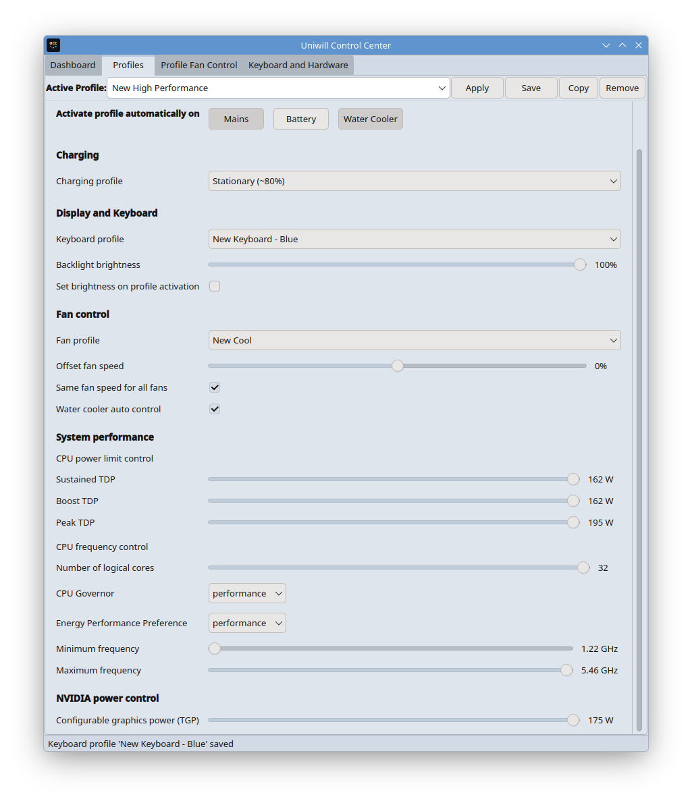
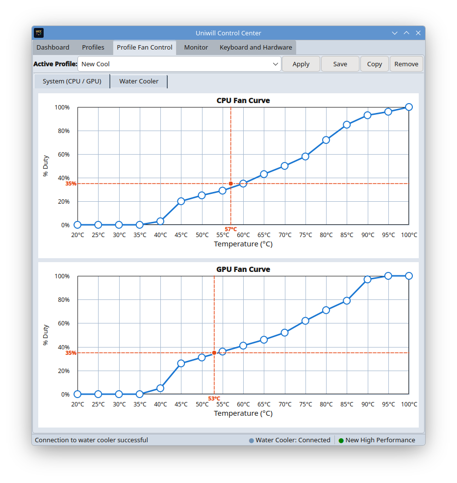
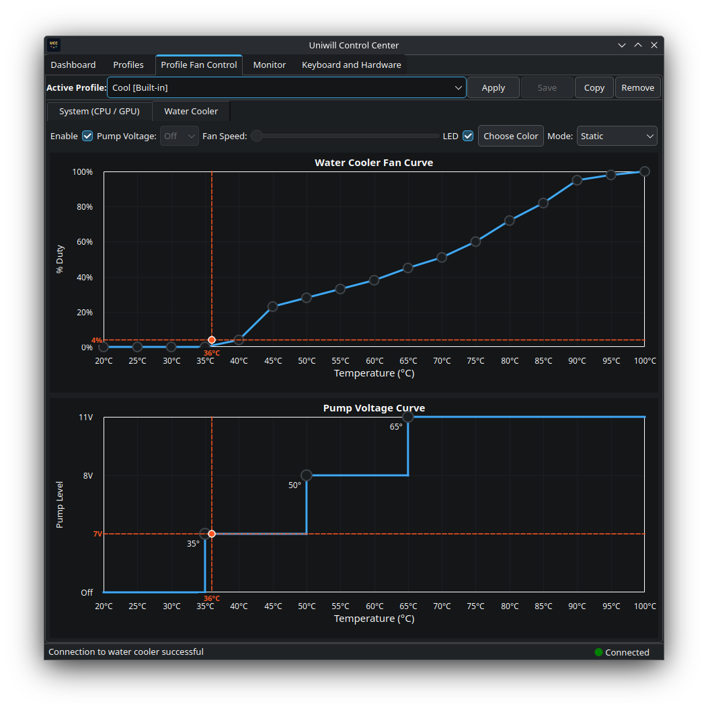
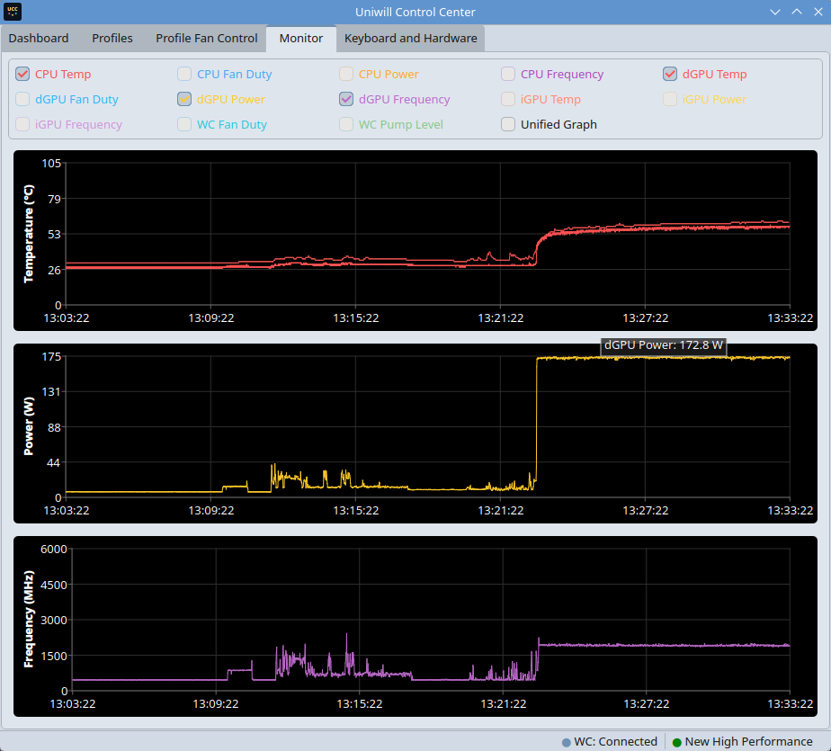
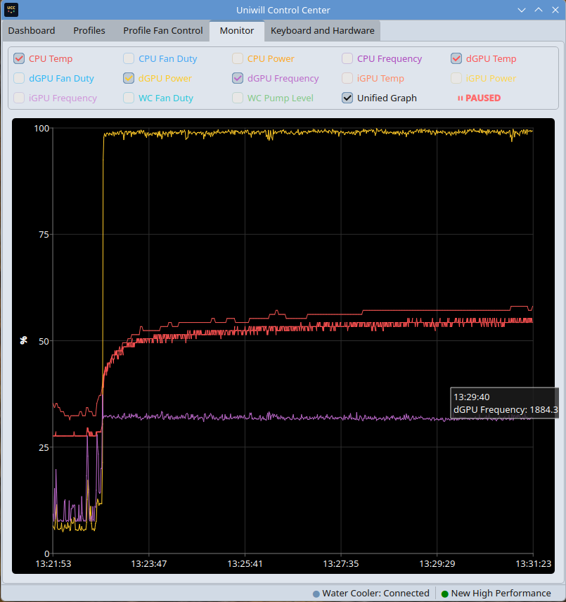
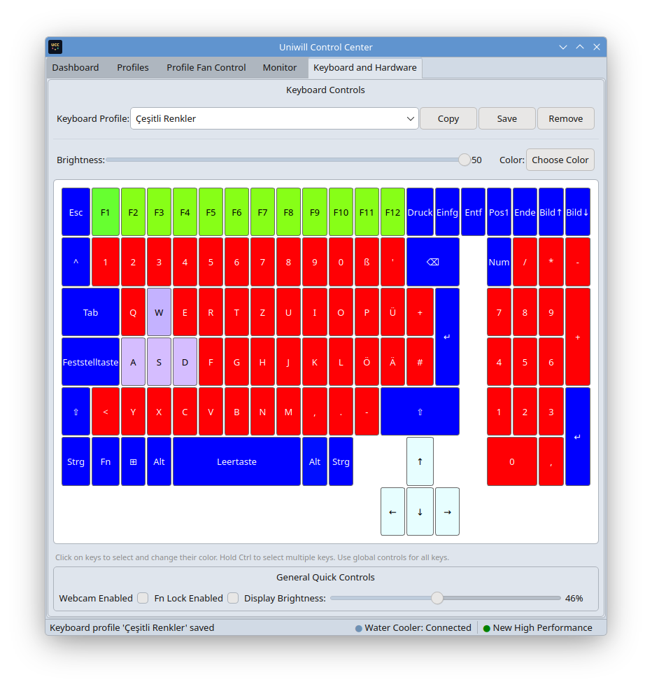

# Uniwill Control Center (UCC)

Modern Qt6/KDE C++20 application suite for Uniwill laptop control.

## Disclaimer

WARNING: This project is experimental and it has only been tested on an XMG Neo 16 A25, but there is no guarantee that it will even work on that properly. Do NOT try it on unsupported systems or in production or on important systems — data loss, hardware misconfiguration, even damage may occur. Testing at your own risk. I'm not responsible for any damage resulting from the use of this tool.

USE AT YOUR OWN RISK

## Components

- **Tuxedo IO**: IO access class taken from Tuxedo Control Center
- **ucc-gui**: Main GUI application using Qt6
- **ucc-tray**: KDE/Plasma system tray applet for quick access.

## Features

- Profile management (view, create, switch profiles)
- Real-time system monitoring (CPU, GPU, fan speeds)
- Power management
- etc.

## Dependencies

### Build Requirements
- CMake >= 3.20
- GCC with C++20 support
- Qt6
- KDE Frameworks 6

### Runtime Requirements
- Qt6 runtime libraries
- KDE Plasma (for widgets)
- tuxedo-drivers (kernel/user drivers required for hardware control)

## Building packages

To produce distribution packages (RPMs) locally you can use the project's
packaging helpers. On a Fedora/RHEL-style environment:

```bash
# clean previous artifacts
make distclean

# build SRPM and RPM (requires rpmbuild and packaging dependencies)
make srpm
make rpm

# for Arch (untested)
make arch

# for Debian / Ubuntu
make deb
```

Note: packaging may require additional host tools (`rpmbuild`, `cmake`,
`ninja`, etc.) and correct distro-specific setup.

## License

GPL-3.0-or-later

## Screenshots














## Architecture

```
┌─────────────┐     ┌─────────────┐     ┌─────────────┐
│   ucc-gui   │────▶│ libucc-dbus │────▶│   uccd      │
└─────────────┘     └─────────────┘     └─────────────┘
                            ▲
                            │
┌─────────────┐             │
│  ucc-tray   │─────────────┤
└─────────────┘             │
                            │
┌─────────────┐             │
│ ucc-widgets │─────────────┘
└─────────────┘
```

All components communicate with the uccd daemon through the shared libucc-dbus library.
