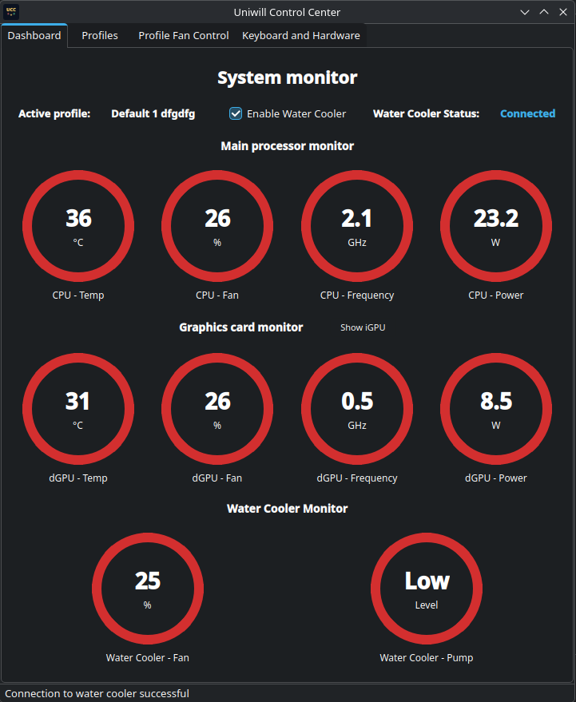
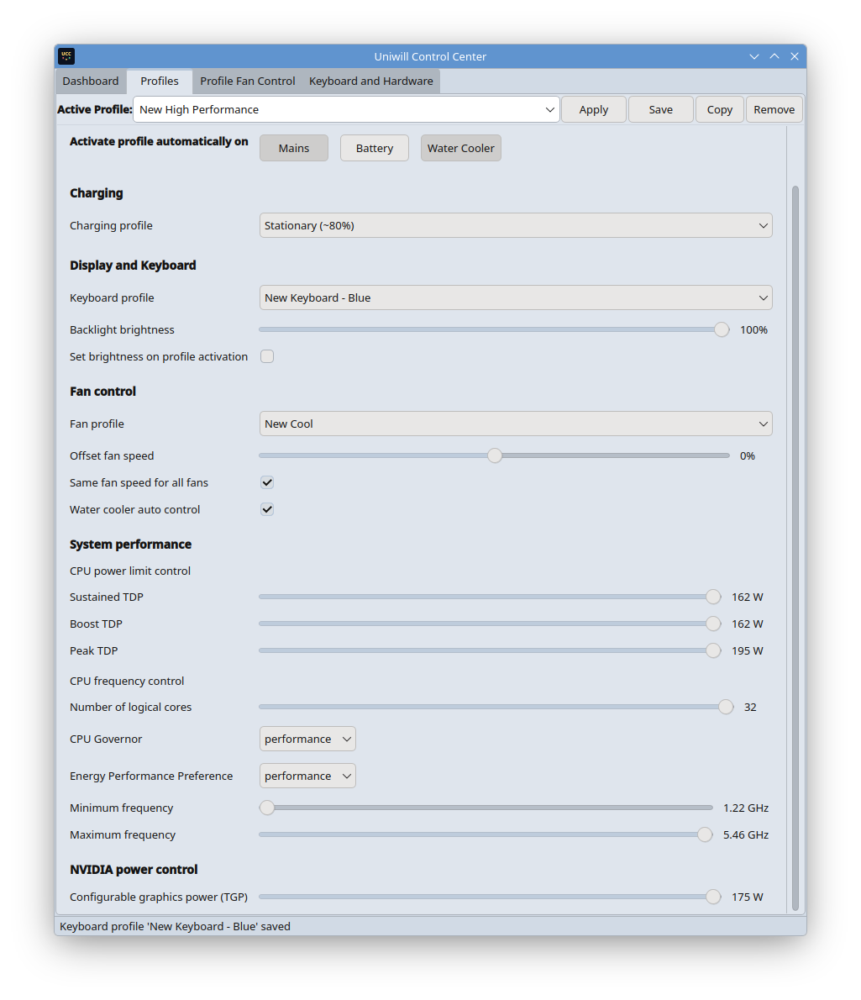
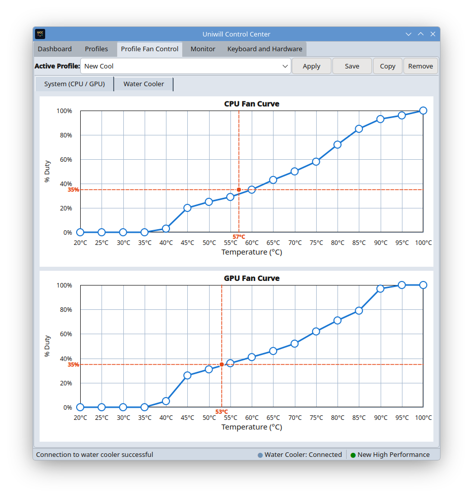
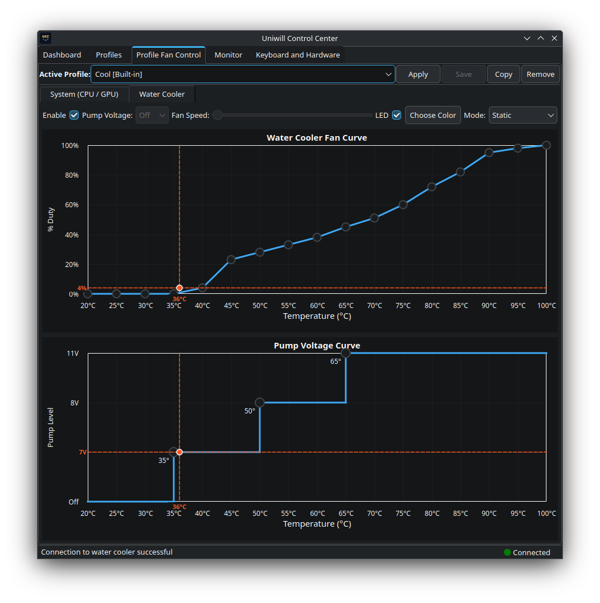
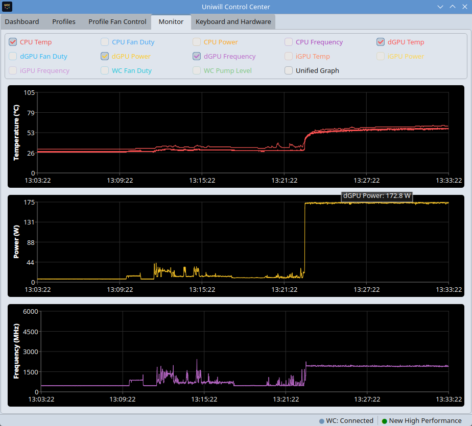
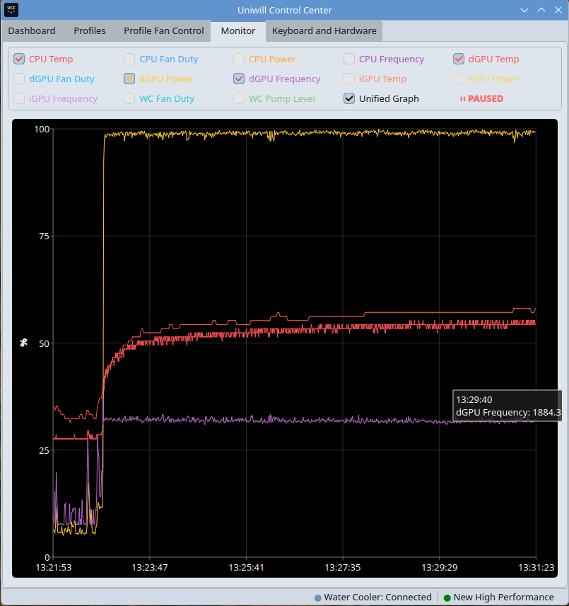
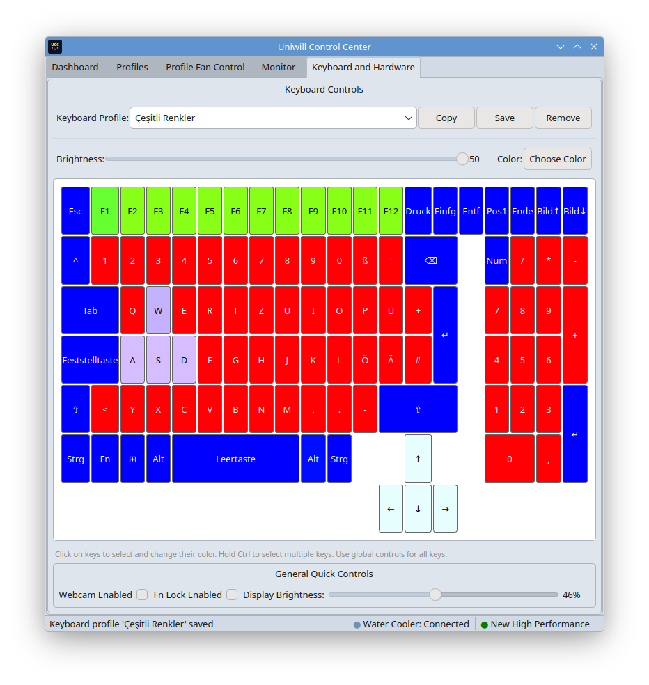

# Uniwill Control Center (UCC)

Modern Qt6/KDE C++20 application suite for Uniwill laptop control.

## Disclaimer

WARNING: This project is experimental and it has only been tested on an XMG Neo 16 A25, but there is no guarantee that it will even work on that properly. Do NOT try it on unsupported systems or in production or on important systems — data loss, hardware misconfiguration, even damage may occur. Testing at your own risk. I'm not responsible for any damage resulting from the use of this tool.

USE AT YOUR OWN RISK

## Components

- **Tuxedo IO**: IO access class taken from Tuxedo Control Center
- **ucc-gui**: Main GUI application using Qt6
- **ucc-tray**: KDE/Plasma system tray applet for quick access.

## Features

- Profile management (view, create, switch profiles)
- Real-time system monitoring (CPU, GPU, fan speeds)
- Power management
- etc.

## Dependencies

### Build Requirements
- CMake >= 3.20
- GCC with C++20 support
- Qt6
- KDE Frameworks 6

### Runtime Requirements
- Qt6 runtime libraries
- KDE Plasma (for widgets)
- tuxedo-drivers (kernel/user drivers required for hardware control)

## Building

### Standard CMake Build

```bash
mkdir build && cd build
cmake .. -DCMAKE_BUILD_TYPE=Release
make -j$(nproc)
sudo make install
```

### Distribution Packages

To produce distribution packages locally:

```bash
# clean previous artifacts
make distclean

# build SRPM and RPM (Fedora/RHEL)
make srpm
make rpm

# for Arch (untested)
make arch

# for Debian / Ubuntu
make deb
```

Note: packaging may require additional host tools (`rpmbuild`, `cmake`,
`ninja`, etc.) and correct distro-specific setup.

### Nix / NixOS

The project provides a Nix flake with a package and NixOS module.

#### Building with Nix

Using flakes (recommended):

```bash
# Build the package
nix build

# Enter a development shell
nix develop
```

Without flakes:

```bash
nix-build
```

#### Installing on NixOS

Add the flake to your system configuration:

```nix
# flake.nix
{
  inputs = {
    nixpkgs.url = "github:NixOS/nixpkgs/nixos-unstable";
    ucc.url = "github:nanomatters/ucc";
  };

  outputs = { self, nixpkgs, ucc, ... }: {
    nixosConfigurations.yourhost = nixpkgs.lib.nixosSystem {
      system = "x86_64-linux";
      modules = [
        ./configuration.nix
        ucc.nixosModules.default
      ];
    };
  };
}
```

Then enable the service in your NixOS configuration:

```nix
# configuration.nix
{
  services.uccd = {
    enable = true;
    # Optional: extra arguments passed to uccd
    # extraArgs = [ "--verbose" ];
    # Optional: disable sleep handler (enabled by default)
    # enableSleepHandler = false;
  };
}
```

Rebuild your system:

```bash
sudo nixos-rebuild switch
```

#### NixOS Module Options

| Option | Type | Default | Description |
|--------|------|---------|-------------|
| `services.uccd.enable` | bool | `false` | Enable the uccd daemon |
| `services.uccd.package` | package | `pkgs.ucc` | The UCC package to use |
| `services.uccd.extraArgs` | list of strings | `[]` | Extra arguments for uccd |
| `services.uccd.enableSleepHandler` | bool | `true` | Restart uccd on suspend/hibernate |

#### Using the Overlay

You can also use the overlay to add `ucc` to your pkgs:

```nix
{
  nixpkgs.overlays = [ ucc.overlays.default ];
  environment.systemPackages = [ pkgs.ucc ];
}
```

## License

GPL-3.0-or-later

## Screenshots















## Architecture

```
┌─────────────┐     ┌─────────────┐     ┌─────────────┐
│   ucc-gui   │────▶│ libucc-dbus │────▶│   uccd      │
└─────────────┘     └─────────────┘     └─────────────┘
                            ▲
                            │
┌─────────────┐             │
│  ucc-tray   │─────────────┤
└─────────────┘             │
                            │
┌─────────────┐             │
│ ucc-widgets │─────────────┘
└─────────────┘
```

All components communicate with the uccd daemon through the shared libucc-dbus library.
